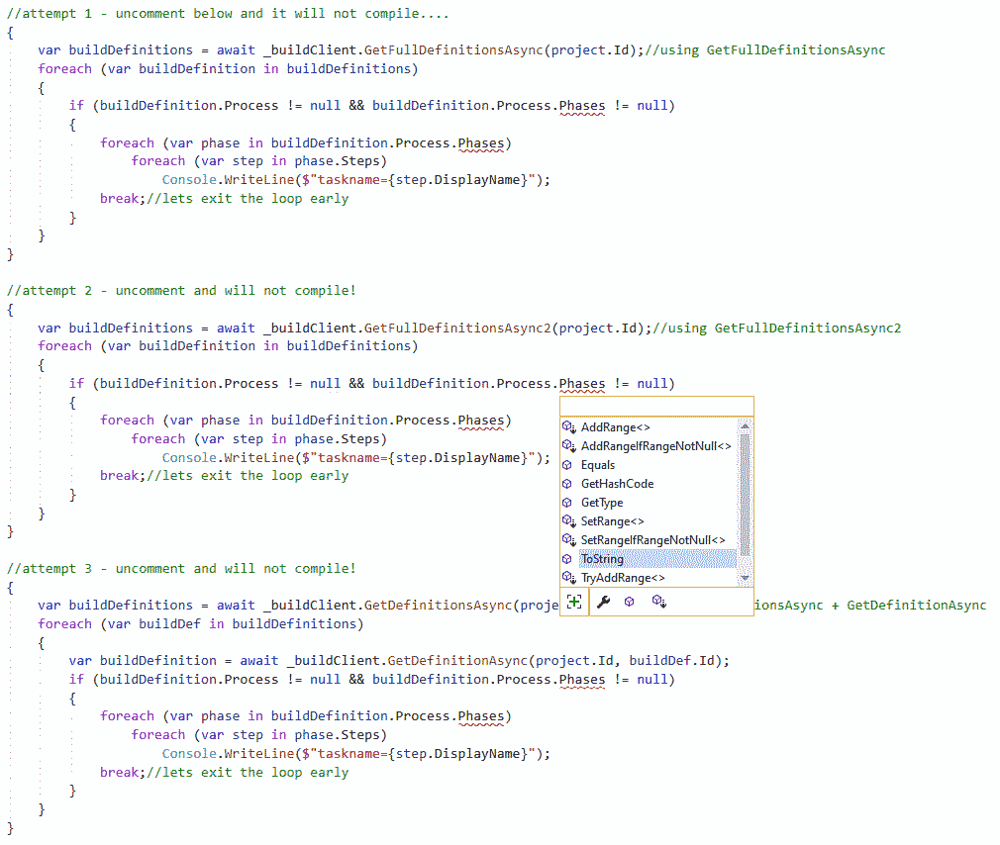

There is an issue in the .NET Client libraries for the Azure DevOps REST API.

When attempting to iterate over the Build tasks within a build definition there are no accessible properties beneath Process.

 

For similar past bug reports see;
- https://dev.azure.com/mseng/AzureDevOps/_workitems/edit/1180374/
- https://stackoverflow.com/questions/52205058/retrieve-the-list-of-tasks-for-build-definition-using-net-client-libraries-for

Currently the only way to get this to work in .NET is to use dynamic, however this isn't desireable as we lose strong typing!
